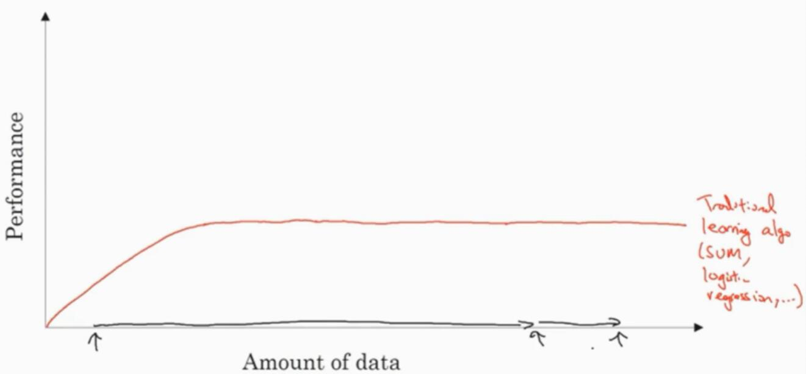
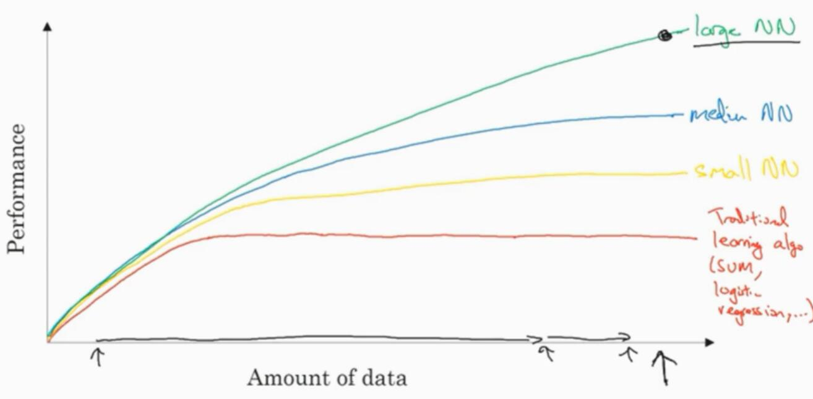
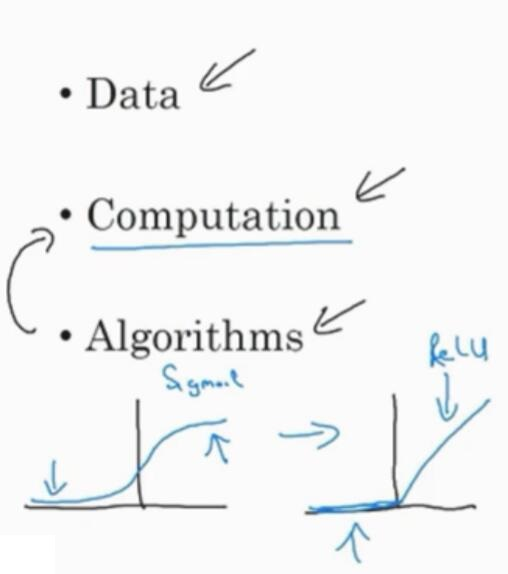
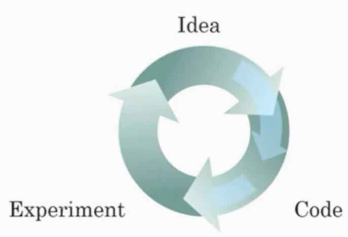

# 1.4 为什么深度学习会兴起？

> 视频：<https://mooc.study.163.com/learn/deeplearning_ai-2001281002?tid=2001392029#/learn/content?type=detail&id=2001702004>

如果深度学习和神经网络背后的基本技术理念，已经有好几十年了，为什么现在才突然流行起来呢？在这个视频中，让我们看一些让深度学习流行起来的主要因素。这将会帮助你在自己的组织中，发现好机会来应用这些东西。

在过去的几年里很多人问我，为什么深度学习突然这么厉害了？我回答的时候通常给他们画个图。横上代表完成任务的数据数量，纵轴代表机器学习算法的性能，比如垃圾邮件过滤的准确率，广告点击预测的准确率，用于无人驾驶中判断其他车辆位置的神经网络的准确率。

根据图像可以发现，把传统机器学习算法的表现，比如说支持向量机，或logistic回归作为数据量的一个函数，你可能得到这样的曲线。它的性能一开始增加数据时会上升，但是一段时间之后它的性能进入平台期。假设水平轴拉的很长很长，那是因为这些模型无法处理海量数据。而过去20年在我们的社会中，我们遇到的很多问题，早期只有相对较少的数据量，多亏了数字化社会，现在收集海量数据轻而易举。

我们人类花了很多时间在数字王国中，在电脑上，在网站上，在手机软件上，数字设备上的活动都能创造数据，同时也归功于便宜的相机，被内置到移动电话，还有加速仪，以及物联网中的各种传感器。我们收集到了越来越多的数据，过去20年，很多应用中我们收集到了大量的数据，远超过传统学习算法能发挥作用的规模。

神经网络模型的话，我们发现，如果你训练一个小型的神经网络，那么性能可能会像这样。如果你训练一个稍微大一点的神经网络，一个中等规模的神经网络，性能表现也会更好一些。你训练一个非常大的神经网络，性能就会是这样，还会越来越好。

注意到两点，一点是如果你想达到这么高的性能水平，有两个条件。第一个是需要训练一个规模足够大的神经网络，以发挥数据规模量巨大的优点。另外，要到x轴的这个位置需要很多的数据。因此我们经常说，规模一直在推动深度学习的进步。

说到“规模”，我指的不仅是神经网络的规模，我们需要一个有许多隐藏单元的神经网络，有许多的参数，许多的连接，而且还有数据“规模”。事实上，要在神经网络上获得更好的表现，在今天最可靠的手段，往往就是要么训练一个更大的神经网络，要么投入更多的数据。这只能在一定程度上起作用，因为最终你耗尽了数据，或者最终你的网络规模太大，需要的训练时间太久。但提升规模已经让我们在深度学习的世界中获得了大量进展。

为了使这个图从技术上更准确一点，我还要加点说明。我在`x`轴下面已经写明了的数据量，技术点说，这是“带标签的数据”量。在训练样本时，我们有输入`x`和标签`y`。我介绍一点符号约定，这在后面的课程中都会用到。我们使用小写的字母`m`，表示训练集的规模，或者说训练样本的数量。这个小写字母`m`这就是水平轴。

图像还有其他细节，训练集不大的这一块来说，各种算法的性能相对排名并不是很确定。训练集不大的时候，效果会取决于你手工设计的组件，会决定最终的表现。因此很有可能，假设有些人训练出了一个SVM，可能是因为手工设计组件很厉害，有些人训练的规模会大一些，可能训练集不大的时候，SVM表现更好。在这个图形区域的左边，各种算法之间优劣并不是定义得很明确，最终的性能更多取决于手工设计组件的技能，以及算法处理方面的一些细节。只有在大数据领域，非常庞大的训练集，也就是在右边`m`非常大时，我们才能见到，神经网络稳定地领先其它算法。

如果某个朋友问你，为什么神经网络这么流行？我鼓励你也给他们画这样一个图像，可以这么说，在深度学习崛起的初期，是数据和计算能力规模的进展。训练一个特别大的神经网络的能力，无论是在CPU还是GPU上，是这些发展才让我们取得了巨大的进步。

但是渐渐地，尤其是在最近这几年，我们也见证了算法方面的极大创新。我也不想忽略算法方面的巨大贡献。有趣的是，许多算法方面的创新，都为了让神经网络运行得更快。举一个具体的例子，神经网络方面的一个巨大突破是，从sigmoid函数转换到这样的ReLU函数。这个函数我们在之前的视频里提到过，形状就像这样。如果你无法理解，刚才我说的某个细节，也不需要担心。但使用sigmoid函数，机器学习问题是，对于这个区域 sigmoid函数的斜率，梯度会接近0，所以学习会变得非常缓慢，因为用梯度下降法时，梯度接近0时，参数会变化得很慢，学习也会变得很慢。而通过改变激活函数，神经网络用这个函数，修正线性单元ReLU，它的梯度对于所有为正值的输入输出都是1，因此梯度不会逐渐趋向0。而这里的梯度，这条线的斜率，在这左边是0。我们发现，只需将sigmod函数转换成ReLU函数，便能够使得“梯度下降法”运行得更快。

这就是一个例子，有点简单的算法创新的例子，但是最终算法创新所带来的影响，是增加计算速度。有很多像这样的例子，我们通过改变算法，使得代码运行得更快。这也使得我们，能够训练规模更大的神经网络，或者在合理的时间内完成计算。即使在数据量很大，网络也很大的场合，快速计算很重要的另一个原因是，训练神经网络的过程，很多时候是凭直觉的。你有了关于神经网络架构的想法，然后你写代码实现你的想法。然后跑一下实验，可以告诉你，你的神经网络效果有多好，知道结果之后再回去，改你的神经网络中的一些细节。然后你不断重复这个循环。当你的神经网络需要很长时间去训练，需要很长时间才能走一圈循环的话，在实现神经网络时，迭代速度对你的效率影响巨大。

如果你有一个想法，直接去试，10分钟后就能看到结果，或者最多花上一天。如果你训练你的神经网络，用了一个月的时间，有时候确实需要那么久。如果你能很快得到结果，比如10分钟或者一天内，你就可以尝试更多的想法。那你就很可能发现，适合你的应用的神经网络。所以计算速度的提升，真的有帮助提高迭代速度，让你更快地得到实验结果。这也同时帮助了神经网络的从业人员，和有关项目的研究人员，在深度学习的工作中迭代得更快，也能够更快地改进你的想法。所有这些都极大推动了，整个深度学习社区的研究，快到令人难以置信。

人们一直在发明新的算法，持续不断地进步，是这些力量支持了深度学习的崛起。但好消息是，这些力量还在不断发挥作用，让深度学习更进一步。我们看数据，我们的社会还在产生更多的数字化数据。我们看计算，GPU这类专用硬件还在继续发展，网络速度更快，各种硬件更快。我很有信心，我们实现超级大规模神经网络的能力，或者从计算能力这个角度看，也在继续进展。我们看算法，我希望深度学习研究社区，能在算法上持续创新。基于这些，我们可以乐观地回答，深度学习还会继续进步很多年。

让我们继续，最后一个课程视频中，我们会谈到通过这门课，你能学到什么。
