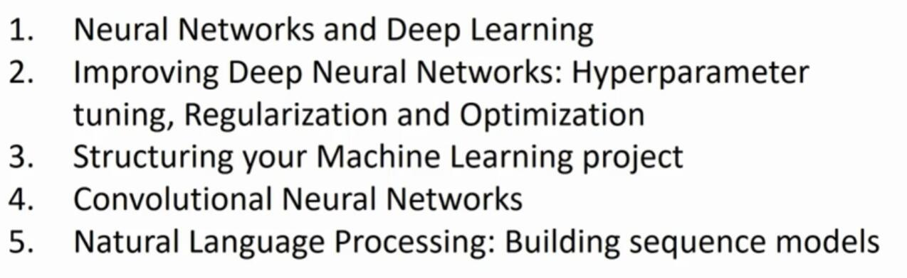
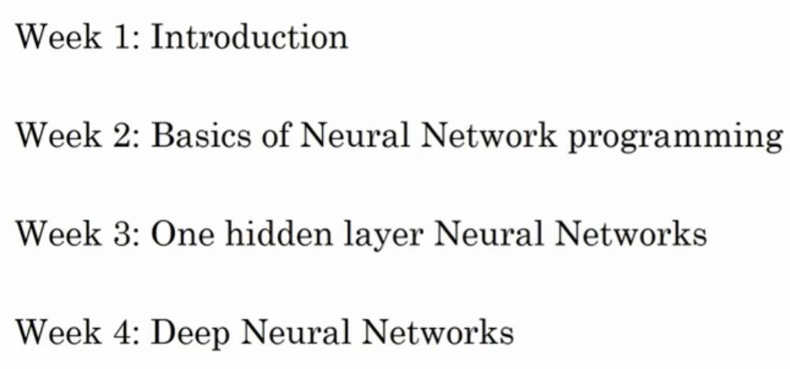

# 1.5 关于这门课

> 视频：<https://mooc.study.163.com/learn/deeplearning_ai-2001281002?tid=2001392029#/learn/content?type=detail&id=2001701007&cid=2001699093>

学习进度来到了这个“微专业”第一门课第一周的最后。快速地介绍一下，下一周将要学习什么内容。在第一个视频里我已经说过，本“微专业”一共有五门课，目前是第一门课。这门课将教会你最重要的基础知识，深度学习最重要的基础。第一门课的结尾，你将掌握如何建立并运用一个深度神经网络。

下面是第一门课的一些细节，这门课有四个星期的学习材料。目前你就要完成第一周的学习了，学完了深度学习的入门介绍。在每一周的结尾，都会有十道多选题，可以用来检验自己对材料的理解。当你看完这个视频的时候，希望你能看看这些问题，

在第二周你会学习到，神经网络的编程基础，了解神经网络中，“正向传播”和“反向传播”的结构，还有算法的过程，以及如何高效实现神经网络。从第二周开始，你也会开始做一些编程练习，练习学到的知识，自己实现算法，亲自调试到完美运行。当我学习算法的时候，那让我很过瘾，通过代码编程，亲自看到它完美运行。我希望你们也喜欢。

在学习了神经网络编程的框架之后，在第三周，你会编写单隐层神经网络，你需要学习所有必需的关键概念，才能实现神经网络。最后在第四周，你将建立了一个多层的深层神经网络，让它为你服务。

恭喜你完成了这段视频，我希望你现在对深度学习，有一个高层次的理解。也许有些人会想，自己想到了，哪里可以应用深度学习。我希望看完这段视频后，你会去看那10个多项选择题，它们就在课程网站上，来检查你的理解。不用复习，第一次做不知道所有答案，你可以多做几次，直到你都做对了为止。我觉得这些问题很有用，能保证我理解了所有概念，我希望你也可以做到。

再次祝贺你看到了这里，期待在第二周的视频中也看到你。
