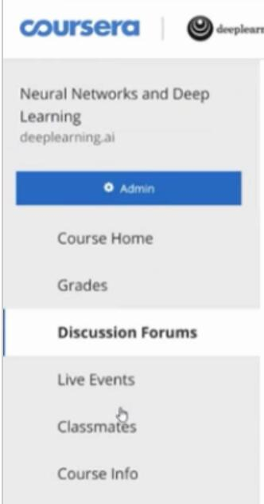
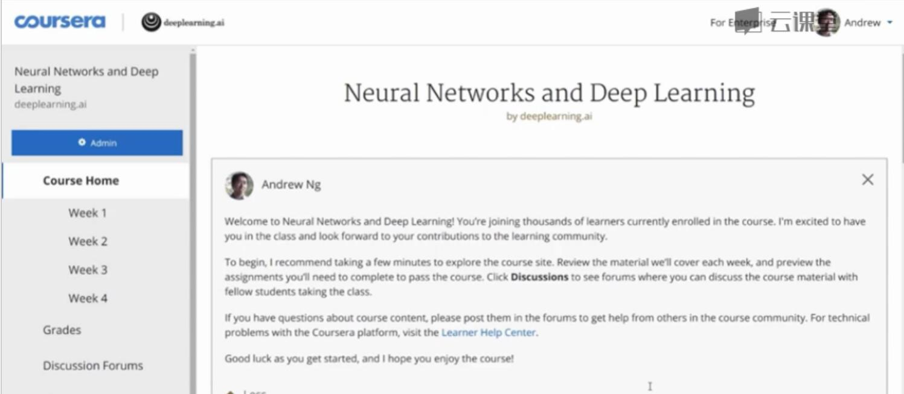
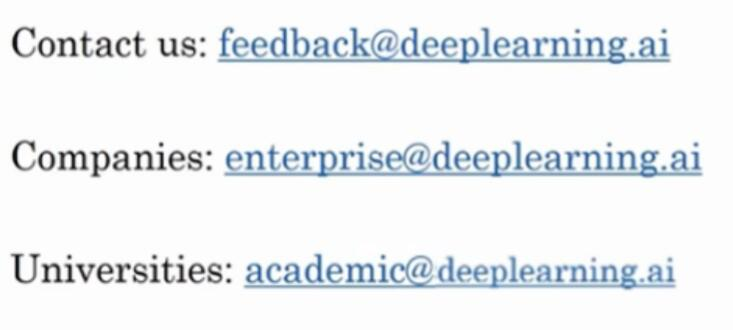

# 1.6 课程资源

> 视频：<https://mooc.study.163.com/learn/deeplearning_ai-2001281002?tid=2001392029#/learn/content?type=detail&id=2001702005&cid=2001694008>

希望你能够喜欢这门课程。为了帮助你完成课程，我想要确保，你知道有下面这些课程材料。

首先如果你有任何疑问，想和这个课程的其它同学讨论，想和包括我在内的教学人员讨论，或者想要归档一个错误报告，论坛是去做这些事情最好的地方。我和其他教学人员 会定期关注论坛，这也是一个，从与你一同学习本课程的同学获取答案的好地方。如果你想要回答同学们的问题，可以从课程首页来到课程的论坛。

如果你看到左侧的这个菜单栏，你的可能会看起来和我的有些不一样，但都会有这个论坛模块。当你点击它的时候，就会打开课程论坛。

在论坛上提问是问问题的最好方法，出于某些原因你可能想直接联系我们，或是想让我们知道一些问题，尽管把邮件发送到这个邮箱地址。我保证我们会阅读每一个邮件。我们会尽力去解决经常出现的问题，由于电子邮件的数量很多，我不能保证我们能够迅速回复每一封邮件，但是我们会阅读你发送的每一封邮件。

另外有些其它公司，想要给大批的职员培训深度学习的话，如果你在公司是负责培训工作，想深度学习专家来培训上百或者更多的雇员，尽管通过这个电子邮箱联系我们，我们看看能否帮到你。我们在开发大学课程，但处于早期的阶段，如果你是大学领导，或者管理人员，想在学校提供一门深度学习课程，请尽管通过这个邮箱地址联系我们。

我会提供更多的资源，来完成这门课程，也许我会在论坛见到你噢，祝你好运。
