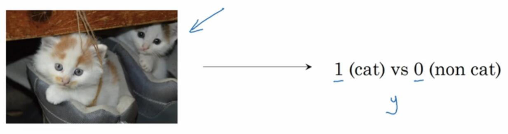
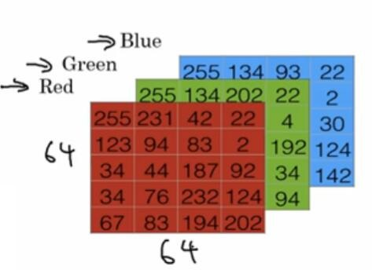
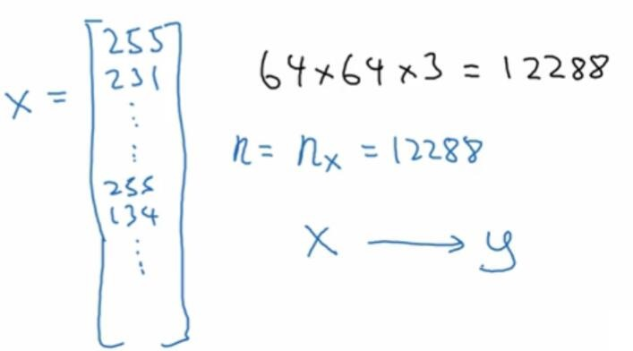
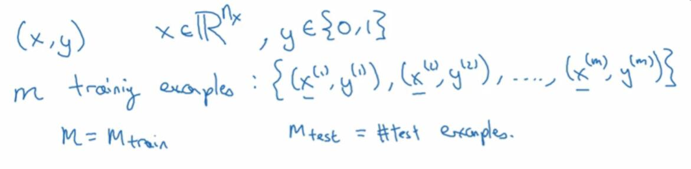
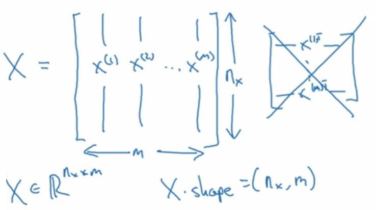
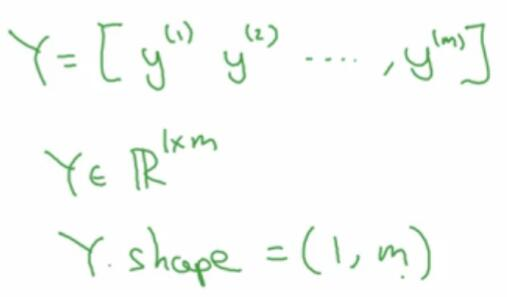

# 2.1 二分分类

> 视频：<https://mooc.study.163.com/learn/deeplearning_ai-2001281002?tid=2001392029#/learn/content?type=detail&id=2001702006>

这一周的课程会使用 logistic 回归来解释神经网络的基本概念。logistic 回归是用于二分分类的算法。

我们以一个实际的例子来讲解二分分类。假如你有一堆图片，你想让计算机判断它们是不是猫的图片，你就需要一个分类器。它接受你的图片作为输入，输出标签，如果是猫则为`1`，不是则为`0`。（还记得硅谷第四季里面的“不是热狗”分类器嘛？）

这里，输入或者是特征表示为`x`，输出或者是标签，表示为`y`。

图片在计算机中使用三个独立矩阵来表示（也有可能是一个三维数组，比如`numpy`里面），它们分别对应红、绿、蓝三个颜色通道（也有可能是四个，还有一个 Alpha 通道）。为了方便表示，这里表示为三个小矩阵，它们是`5×4`的，并不是`64×64`的。

为了将图片转换为特征（一维向量），一个简单粗暴的办法就是，将三个矩阵分别展开，然后再拼接上。那么我们先取红色矩阵中的`255, 123, ..., 102`，然后是绿色矩阵，然后是蓝色矩阵。最后我们得到一个很长很长的向量，它的长度是`64x64x3=12288`。我们用`n_x`来表示特征向量`x`的维度，为了简洁可以简写为`n`。

下面是一些符号约定。我们用`(x,y)`表示一个样本，其中`x`是`n`维特征向量，`y`是`0`或者`1`的标签。训练集的长度为`m`，有时候写为`m_train`。`(x^(i),y^(i))`表示第`i`个样本。

提到测试集时，会用`m_test`表示其样本数。大写的`X`，表示训练集或者测试集的所有特征。它是一个`nxm`的矩阵，列是`x^(i)`这些样本特征，行是不同样本相同特征。

有时候矩阵`X`的定义是其转置。也就是说，行是样本特征，这个在 ScikitLearn 里面很常见。构建神经网络时，用左边这个约定形式。会让构建过程简单得多。

同样为了方便，`Y`表示训练集或者测试集的所有标签。它是一个`1xm`的矩阵，包含`y^(i)`这些标签。当你用 NumPy 实现的时候，你可以调用`X.shape`获取矩阵的维度`(n,m)`。`Y.shape`等于`(1,m)`。

