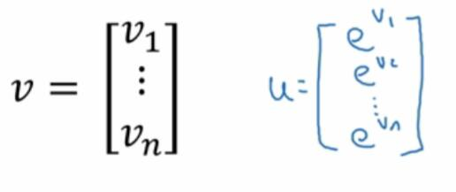
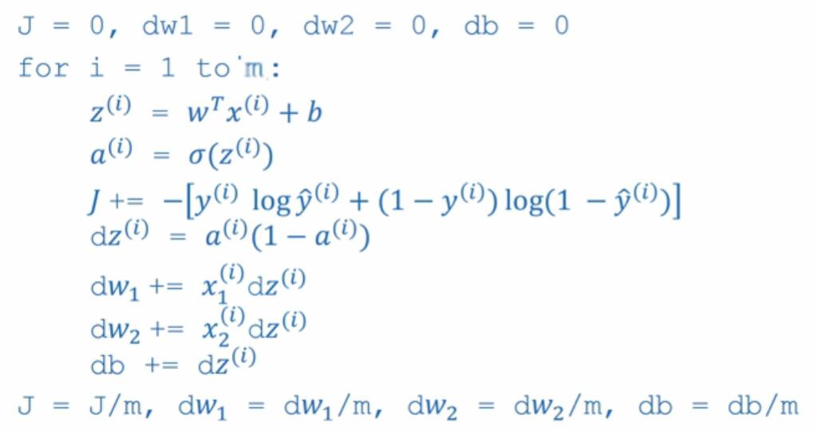

# 2.12 更多向量化的例子

> 视频：<https://mooc.study.163.com/learn/deeplearning_ai-2001281002?tid=2001392029#/learn/content?type=detail&id=2001701014>

首先，经验法则是，避免显式的`for`循环。你可以使用内置函数，或者其它方式避免它，使代码运行更快。

（1）向量`u`是矩阵`A`和向量`v`的乘积：

```
u = Av
u_i = ∑_j A_ij*v_j
```

非向量化的版本为：

```py
u = np.zeros((n, 1))
for i in ...:
    for j in ...:
        u[i] += A[i, j] * v[j]
```

向量化的版本为（你要确保`v`是二维`nx1`数组）：

```py
u = np.dot(A, v)
```

（2）你有一个数组`v`，想对`v`的每个元素做指数运算：



非向量化的版本为：

```py
u = np.zeros((n, 1))
for i in range(n):
    u[i] = math.exp(v[i])
```

向量化的版本为：

```py
u = np.exp(v)
```

实际上，NumPy 有许多向量化的内置函数，比如`log, abs, maximun, x ** 2, 1/x`等等。对于一个运算，你应该先看看能不能用 NumPy 来算，尽可能避免`for`循环。

让我们看看这些技巧如何应用于 logistic 回归。这是用于计算 logistic 导数的程序：



第一个循环就是上面的`for`，第二个循环就是`dw1`和`dw2`的计算。这个例子中`nx=2`，如果你有`n`个特征，你需要依次处理`dw1`、`dw2`等等。

如果我们要去掉第二个循环，我们可以在第一行初始化为：

```py
dw = np.zeros((nx, 1))
```

然后在循环中，更新为：

```
dw = x^(i) dz^(i)
```

然后最后：

```py
dw /= m
```

所以现在只有一个对每个样本的循环了。

