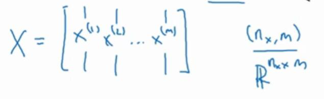
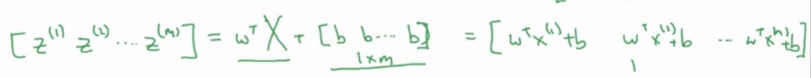

# 2.13 向量化 logistic 回归

> 视频：<https://mooc.study.163.com/learn/deeplearning_ai-2001281002?tid=2001392029#/learn/content?type=detail&id=2001702011>

我们已经讨论过向量化了，但是目前我们还是一次计算一个样本。下面我们尝试一次处理整个训练集，所以就不用任何`for`循环了。

下面是我们的公式：

```
z^(i) = w^T x^(i) + b
a^(i) = σ(z^(i))
```

之前的步骤中，我们需要让`i`为`0,1,2..`来处理每个样本。但有一个办法可以不需要任何循环来计算它。

我们之前有个大写的`X`，它表示整个样本特征。它是按列堆叠的，也就是说，`x(i)`是其第`i`列：



我们可以这样直接计算`z`：

```py
z = np.dot(w.T, X) + b
```

由于矩阵乘法，或者说点积是一行乘一列，我们可以直接计算`np.dot(w.T,X)`。道理很简单，`w.T`是个行向量，`X`的每一列都是一个样本的特征`x^(i)`，所以你得到的矩阵的每个元素都是`w^T x^(i)`。由于`w.T`是`1xn`的，`X`是`nxm`的，所以得到的矩阵的`1xm`的行向量。

由于广播机制，这个向量和`b`相加时，由于`b`是个标量，所以会将向量的每个元素都加上`b`。



之后的`a`简单多了，我们直接对`z`调用 sigmoid 函数：

```py
a = sigmoid(z)
```

（要注意，在 NumPy 中，你要保证函数是向量化的。如果你不知道如何创建向量化函数，可以直接展开，`a = 1 / 1 + np.exp(z)`。）

我们所有的这些计算，不需要`for`运算，而是只用了一步。你应该理解了正向传播的向量化方法，下一节是如何使用向量化高效计算反向传播。

