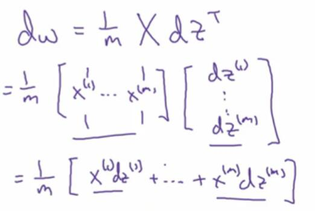

# 2.14 向量化 logistic 回归的梯度输出

> 视频：<https://mooc.study.163.com/learn/deeplearning_ai-2001281002?tid=2001392029#/learn/content?type=detail&id=2001701015&cid=2001693015>

上一节我们了解了如何向量化正向传播，下面要讲反向传播，也就是计算导数的步骤。

在求`dz^(i)`的时候，我们的公式是：


由于根据上一节，`A`是行向量，然后根据我们的定义，`Y`也是行向量。所以：

```py
dZ = A - Y
```

然后难点来了，我们求`dw`和`db`的公式是：


我们去掉了遍历`dw_j`的`for`循环，但还有个`for`循环遍历训练集。让我们也把它去掉。

我们看到，`db`只是对`dz^(i)`求均值，所以，`db = np.sum(dZ) / m`（或者`np.mean(dZ)`）。

然后，`dw`是`np.dot(X, dZ.T) / m`，让我们看看为什么是这样。



解释一下，你可以把`X`分块，看成`x^(i)`的行向量，其中`x^(i)`本身也是列向量。然后一行乘一列，得到的就是`dz^(i)x^(i)`。

然后我们得到了高度向量化的代码。它最外面有个控制迭代次数的`for`循环，应该没办法去掉。（它的效率很高，但是可读性很差，所以最好注释一些数学公式什么的。）


