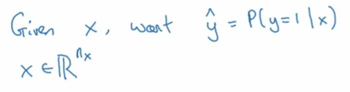
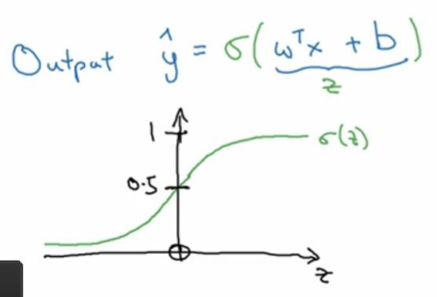
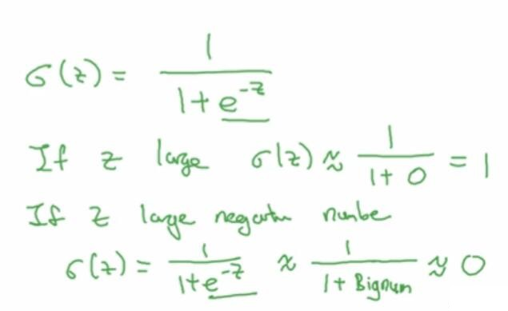
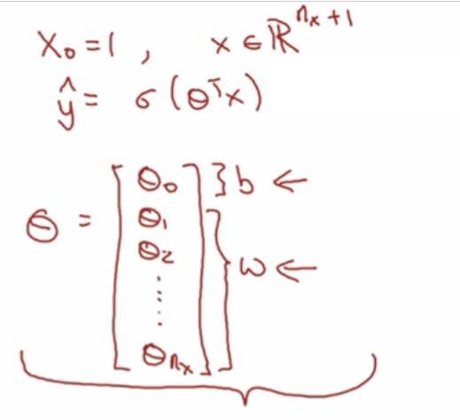

# 2.2 Logistic 回归

> 视频：<https://mooc.study.163.com/learn/deeplearning_ai-2001281002?tid=2001392029#/learn/content?type=detail&id=2001701008>

假设你有了输入特征`x`，你就需要一个算法，判断它是否位于两个分类中的某个。Logistic 回归可以用于这个目的，只不过它输出特征位于某个分类的概率。

在线性回归中，我们的拟合函数是`y_hat = w^Tx + b`。但在 Logistic 回归里，这个函数就行不通了，因为概率是`0`和`1`之间的数值。

为了解决这个问题，我们可以引入 sigmoid 函数，用`σ(z)`表示。它的函数图像在下面，是从`0`到`1`的光滑函数，与纵轴相交于`0.5`处。然后，我们让`y_hat = σ(w^Tx + b)`。

它的定义是`σ(z) = 1/(1+e^-z)`。然后我们要注意一些东西，如果`z`非常大，那么`e^-z`就非常小，`1`比上`1`加一个非常小的数（可以看做`0`），结果是`1`。反之，如果`z`非常小，也就是绝对值很大的负数，`e^-z`就会非常大，`1`比上`1`加一个非常大的数，结果是`0`。

所以，当你实现 logistic 回归时，你需要拟合参数`w`和`b`。

下面是一些符号约定。有时候你会看到，`w^Tx + b`会写成`θ^Tx`。后面那种情况中，`θ`和`x`都是`n+1`维的向量。`x`是第一项是`x_0=1`，`θ`的第一项是`b`，之后才是`w_1`到`w_n`。

也就是说，这两种记法是等价的。但当你实现你的神经网络时，将`b`和`w`看作独立的参数可能更好，所以不会用后面那种记法。
