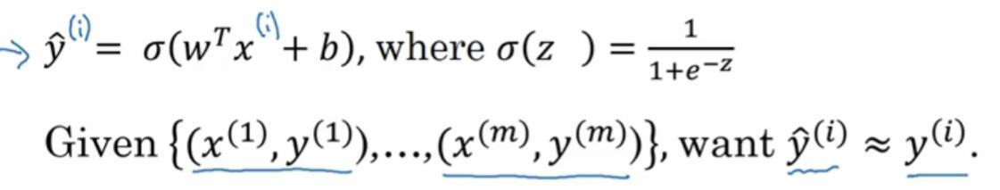
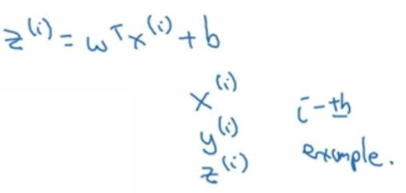
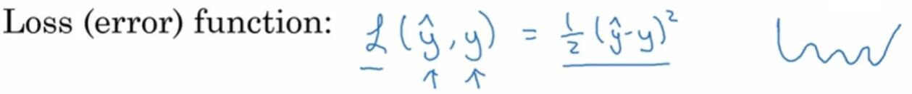
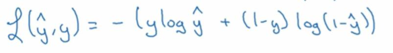
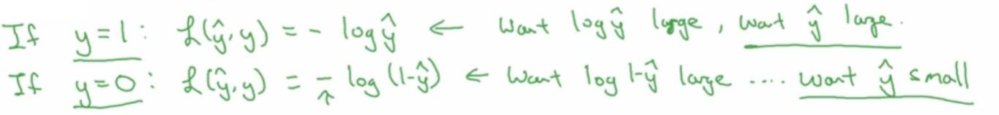
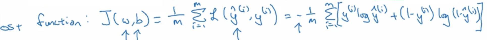

# 2.3 Logistic 回归损失函数

> 视频：<https://mooc.study.163.com/learn/deeplearning_ai-2001281002?tid=2001392029#/learn/content?type=detail&id=2001701009&cid=2001694012>

在上一个视频中，你看到的是 logistic 回归的模型。为了训练 logistic 回归模型的参数`w`以及`b`，需要定义一个成本函数。让我们来看一下，用于训练 logistic 回归的成本函数。

回忆一下，这是上一张幻灯片的函数，所以你的输出`y_hat=sigmoid(w^Tx+b)`，这里定义为sigmoid(z)。为了让模型通过学习来调整参数，要给一个`m`个样本的训练集，很自然地，你想通过在训练集找到参数`w`和`b`，来得到你的输出。

对训练集的预测值，写成`y_hat^(i)`，我们希望它会接近于训练集中的`y^(i)`值。为了让上面的方程更详细一些，需要说明上面这里定义的`y_hat`，是对一个训练样本`x`来说的。对于每个训练样本，我们使用这些带有圆括号的上标，方便引用说明还有区分样本。你的训练样本`(i)`对应的预测值是`y_hat^(i)`，是用训练样本，通过 sigmoid 函数作用到`wT*x^(i)+b`得到的。

你也可以将`z^(i)`定义成这样，`z^(i)`等于`wT*x^(i)+b`。在这门课里，我们将使用这个符号约定，就是这个上标`(i)`来指明数据，表示`x`或者`y`或者`z`和第`i`个训练样本有关。这就是上标`(i)`的含义。

现在我们来看看损失函数，或叫做误差函数，它们可以用来衡量算法的运行情况。你可以定义损失为，`y_hat`和`y`的差的平方，或者它们差的平方的`1/2`。结果表明你可以这，样做但通常在 logistic 回归中，大家都不这么做。因为当你学习这些参数的时候，你会发现之后讨论的优化问题，会变成非凸的。最后会得到，很多个局部最优解。梯度下降法可能找不到全局最优值。如果你不理解这几句话，别担心，我们会在后面的视频中讲到它。

但是这个的直观理解就是，我们通过定义这个损失函数`L`，来衡量你的预测输出值`y_hat`和`y`的实际值有多接近。平方误差看起来似乎是一个合理的选择，但用这个的话，梯度下降法就不太好用。

在 logistic 回归中，我们会定义，一个不同的损失函数，它与平方误差有相似的作用。这些会给我们一个凸的优化问题，在后面的视频能看到，它很容易去做优化。在 logistic 回归中，我们会使用这里写的损失函数。它是`-(y*log(y_hat) + (1-y)log(1-y_hat))`。

直观地看看为何这个损失函数能起作用。记得如果我们使用平方误差，它越小越好。对于这个 logistic 回归的损失函数，同样地，我们也想让它尽可能地小。为了更好地理解，为什么它能够起作用，让我们来看两个例子。

在第一个例子中，我们说`y=1`时，损失函数就正好是第一项，`L(y_hat,y)`，带个负号，就是`-log(y_hat)`。因为如果`y=1`那么第二项`1-y`就等于`0`。这就是说当`y=1`时，你想让`-log(y_hat)`尽可能小，这就是说想让`log(y_hat)`足够大，这就是说，你想要`y_hat`足够大。但是因为`y_hat`是 simoid 函数得出的，永远不会比`1`大。也就是说，如果`y=1`时，你想让`y_hat`尽可能地大，但它永远不会大于`1`，所以你要让`y_hat`接近`1`。

另一个情况就是如果`y=0`，损失函数的第一项等于`0`，然后第二项就是这个损失函数。损失函数变成`-log(1-y_hat)`。在学习过程中，想让损失函数小一些，也就是说，你想要`log(1-y_hat)`够大，因为这里有一个负号。通过这一系列推理，你可以得出，损失函数让`y_hat`尽可能地小。同样，因为`y_hat`只能介于`0`到`1`之间，这就是说，当`y=0`时，损失函数会让`y_hat`尽可能地接近`0`。

有很多函数都能达到这个效果，如果`y=1`我们尽可能让`y_hat`很大 ，如果`y=0 `尽可能让`y_hat`足够小。绿色字体这里稍微解释了，为什么用这个作为损失函数。后面我们会提供选修视频，给出这样做的更正式的原因。解释为什么在 logistic 回归中，要用这个形式的损失函数。

最后说一下，损失函数是在单个训练样本中定义的。它衡量了，在单个训练样本上的表现。下面我要定义一个成本函数，它衡量的是在全体训练样本上的表现。这个成本函数`J`，根据之前得到的两个参数`w`和`b`，`J(w, b)`等于，`1/m * ∑L(y_hat^(i), y^(i))`，即所有训练样本的损失函数和。而`y_hat`是用一组特定的参数`w`和`b`，通过 logistic 回归算法得出的预测输出值。所以把这个展开，这等于`-1/m`乘以从`i=1`到`m`的损失函数的和。我在这里画上方括号，负号在这一堆式子的外面。

术语这样来用，损失函数只适用于像这样的单个训练样本。这个成本函数是基于参数的总成本。所以在训练 logistic 回归模型时，我们要找到合适的参数`w`和`b`，让下面这里的成本函数`J`尽可能地小。

你刚刚看到了 logistic 回归算法的过程，以及训练样本的损失函数，还有和参数相关的总体成本函数。结果表明 logistic 回归可以被看作是 一个非常小的神经网络。

在下一个视频里 我们将会学到，直观地去理解神经网络能做什么。继续看下一段视频，看看如何将 logistic 回归，看作一个非常小的神经网络。
