# 2.4 梯度下降法

> 视频：<https://mooc.study.163.com/learn/deeplearning_ai-2001281002?tid=2001392029#/learn/content?type=detail&id=2001701010>

下面讨论如何使用梯度下降，来找到`w`和`b`，使成本函数最小。下面是上一节中的拟合函数和成本函数。

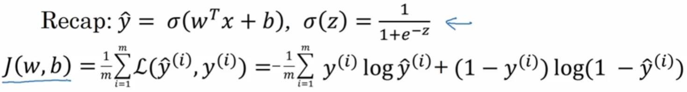

下面来看看梯度下降法。下图中的二元函数`J(w,b)`就是一个凸函数（我们暂且考虑下凸）。在实践中，`w`是一个向量，这个函数可能是更高维的，但为了简便，我们让`w`和`b`都是实数。这个函数是`w`和`b`轴上的曲面，曲面的高度代表了`J(w,b)`的值。

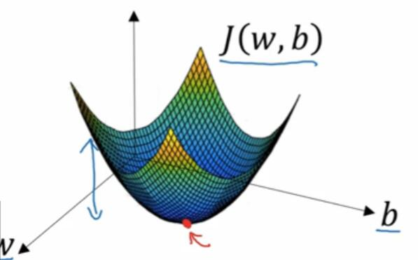

凸函数的形状是像这样的一个大碗。而非凸函数的形状有很大不同，它由多个局部最优。

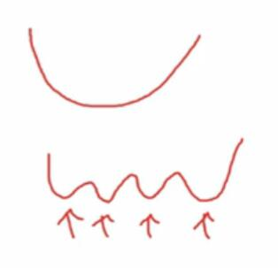

我们可以随便选一个点作为起始点。你可以选`0`，也可以选`1`或者随机值。这个无所谓，因为函数是凸的，沿任意路径下降都会达到全局最优值。

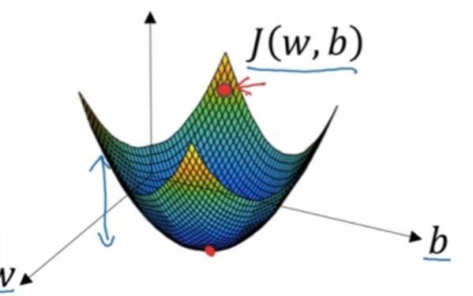

然后，我们沿最陡的方向向下走一步，重复几次之后，就会达到或很接近全局最优值，也就是最底下那个点。

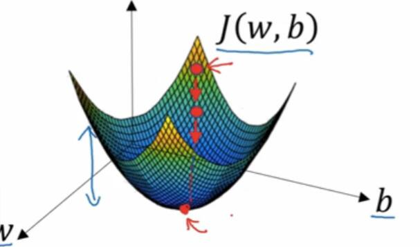

为了更好地说明其原理，我们来看简化的一元函数。

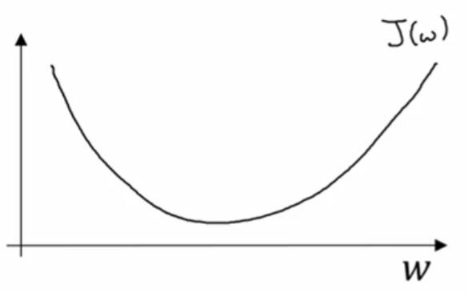

这是一元函数`J(w)`，`w`是实数，你希望找到`J`的最小值。为此，我们需要重复执行这个更新操作：`w := w - α * dJ(w)/dw`。

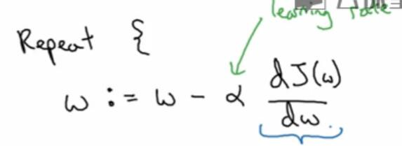

其中，`w`是自变量，`:=`表示更新，`α`是学习率（后面会讲如何选取）。这个`dJ(w)/dw`是`J`对`w`的导数，也就是`J`的更新或变化率（同样后面会讲）。

现在需要确保梯度下降法是有用的。如果我们的`w`在右边，这个点上的导数是正的。导数就是图中小三角形的高除以宽，它的斜边相切于曲线。如果我们从`w`中导数和学习率的乘积，`w`就向左走了一步，所以梯度下降会逐渐减少`w`。

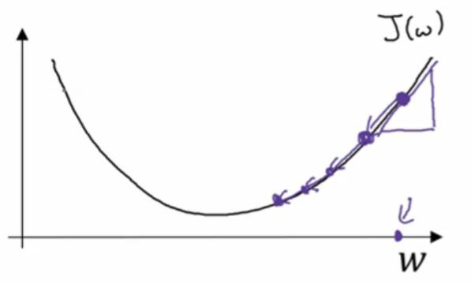

而如果`w`在左边，导数为负（因为`w`减小`J`反而增加）。那么`w`会减去学习率乘一个负数，会使`w`逐渐增加。可见，无论`w`最开始在左边还是右边，它都会向最小值慢慢移动。

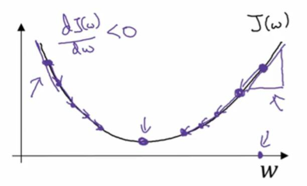

在我们的 logistic 中，`J(w,b)`是多元函数，所以我们需要对`w`的每个元素，以及`b`重复这个步骤。最后的导数也需要变成偏导数。

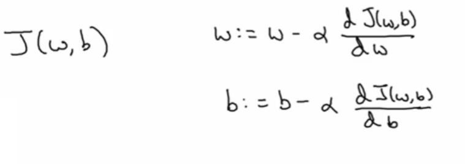

另外需要说明，在微积分中，导数和偏导数是不同的，各种拥有不同的性质。但在机器学习或者数值计算中，导数可以看成偏导数的特例。因为它们的计算方式几乎一样，偏导数是将其它自变量看做常数的情况下，来计算某个自变量的导数。

在微积分的符号约定中，导数使用小写`d`来表示，而偏导数是用花式字体。如果`J`是一元函数，就用小写的`d`，多元函数就用偏导数符号。

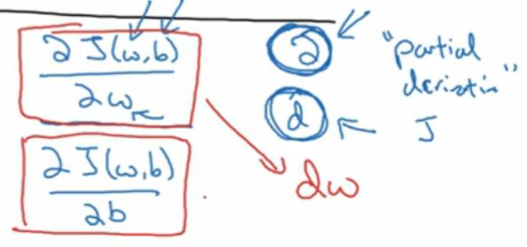

但是这种记法会令人困惑，并且越搞越复杂。在机器学习中，使用哪一种是无关紧要的。上面那张图片应该用偏导数符号，因为`J`有两个自变量，但是所表达的东西和`d`是一样的。

如果你有几年没碰微积分了，也没有关系，因为你不需要深入理解微积分，只需要直观理解它。下一节是导数的直观描述。
