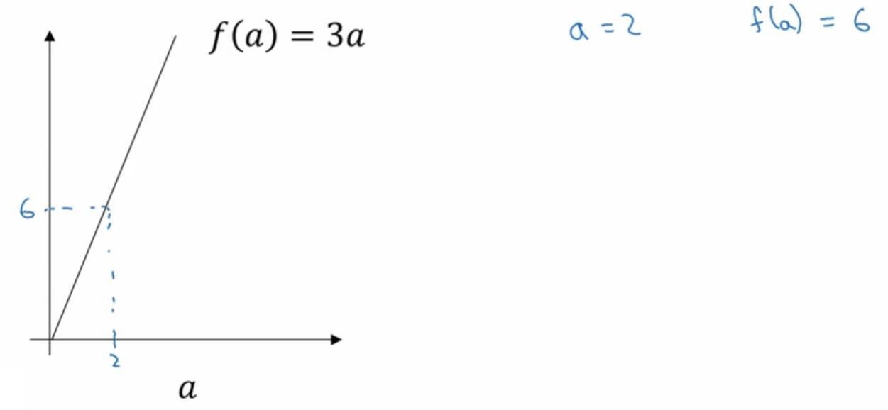
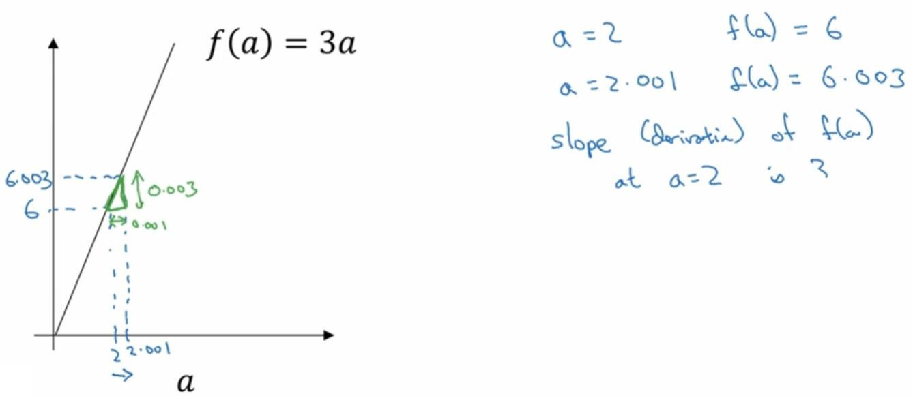
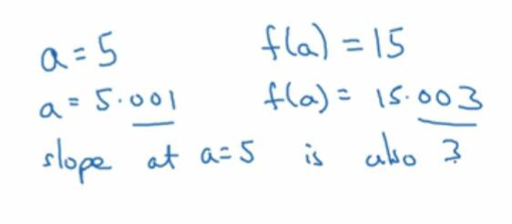
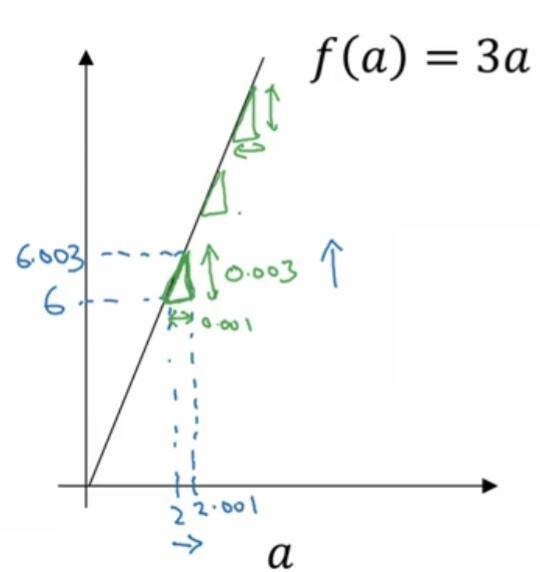
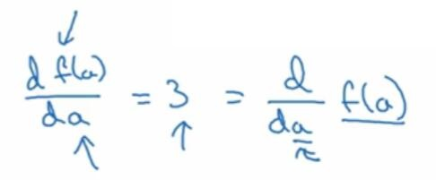

# 2.5 导数

> 视频：<https://mooc.study.163.com/learn/deeplearning_ai-2001281002?tid=2001392029#/learn/content?type=detail&id=2001702007&cid=2001694013>

这个笔记服务于那些不熟悉，或者没学过微积分的人。或许你自从大学后你再也没有接触微积分，没关系，你只需要对微积分有直观的认识，并不需要深入了解，就能运用深度学习。但如果你对微积分非常熟悉，你可以跳过这一节。

首先我们以一个非常简单的例子开始，`f(a)=3a`，它是一条直线。现在我们让`a`等于`2`，那么`f(a)`就等于`6`。

现在，我们将`a`向右稍微移动一些，让`a`是`2.001`吧。那么`f(a)`等于`6.003`。我把它们画在下面的图里面（但是`0.001`的增量实在太小，为了直观起见，比例不太准确）。`f(a)`的增量是`0.003`，`a`的增量是`0.001`前者是后者的`3`倍，所以我们可以初步断定，在`a=2`的这个地方，`f`的导数是`3`。

或许你听说过“导数就是斜率或者变化率”的说法，其实变化率也就是`y`的增量比上`x`的增量。将导数换成斜率，瞬间就变得友好了。

斜率还有一种直观的认识，就是图中的绿色三角形。你可以看到，三角形的高就是`f(a)`的增量，宽就是`a`的增量，高与宽的比值就是斜率。你将`a`向右移动一段距离，`f(a)`总是增加这段距离的三倍。

现在我们让`a=5`，此时`f(a)=15`。我们再次`a`向右移动到`5.001`，那么`f(a)`会变成`15.003`。可得，`a=5`处的斜率也是`3`。

我们发现，`x`和`y`的增量，以及斜率都和上面一样。这个函数的斜率是不变的。也就是说，无论你在哪个地方，它的斜率始终是`3`。我们可以在任何为位置画小三角形，来证明这一点。当然，下面我们会遇到一些斜率变化的函数。

我们可以将`f`的斜率或者导数写作`df(a)/da`。也有另外一个表达方式，`d/da f(a)`。也就是说，无论你写在上面，还是右边，都是一样的。

导数或者斜率有更正式的定义。这种情况下，我们将`a`右移一个非常小的值，不是`0.001`，不是`0.00000001`，不是`0.00000..1`，而是一个无限小的值。然后`f(a)`也会增加这个无限小的三倍。这就是导数的定义，但为了直观认识，我们可以用较小的值来近似。
