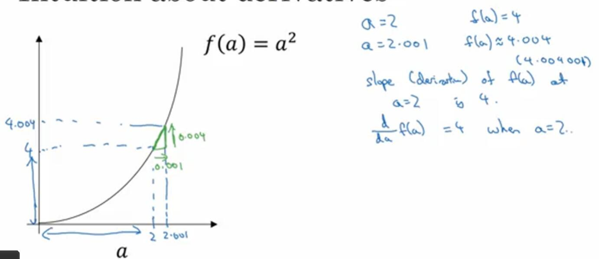
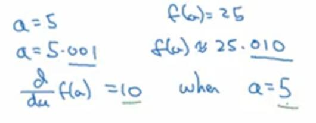
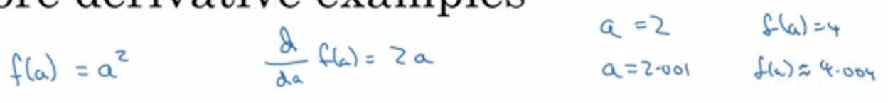
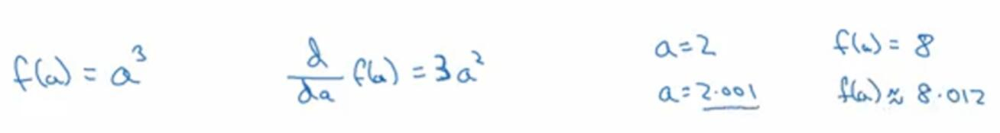
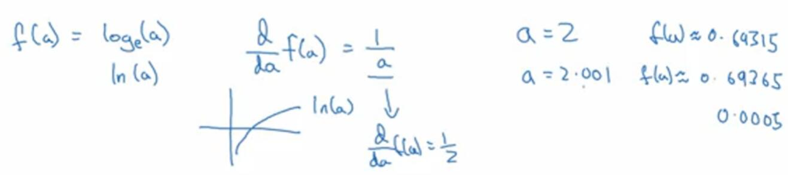

# 2.6 更多导数的例子

视频：<https://mooc.study.163.com/learn/deeplearning_ai-2001281002?tid=2001392029#/learn/content?type=detail&id=2001702008>

这一节会讨论斜率变化的函数。

首先是`f(a)=a^2`。让`a=2`，`f(a)=4`。同样让我们将`a`右移一些，现在`a=2.001`，而`f(a)`约为`4.004`。如果你用计算器的话，可以得到`f(a)=4.004001`，但这里，我们将后面省去了。我们将其画出来，同样为了直观，比例不太准确。

看看这个小三角形，我们得出，`a`的增量是`0.001`，`f(a)`增量是`0.004`。`f(a)`在`a=2`处的导数为`4`。

现在换个点来看，如果`a=5`，不再是`2`，`f(a)=25`。同样将`a`右移一些，`a=5.001`，则`f(a)`约为`25.010`。这次，我们将`a`右移了`0.001`，`f(a)`却增大了`0.010`，是`a`增量的十倍。由此可知，对于函数`f(a)=a^2`，`a`取不同值的时候，它的斜率是不同的，这和上一节中的例子不一样。

有种直观的方法可以解释，为什么一个点的斜率在不同位置会不同。如果你在曲线上的不同位置画一些小三角形，你就会发现，三角形高和宽的比值在曲线上不同的地方是不同的。

如果你查阅微积分的课本，它会告诉你`d/da f(a)`，也就是`d(a^2)/da=2a`（这里就不证明了）。我们可以手动验证一下，`a=2`时，`2a=4`；`a=5`时，`2a=10`。

现在，有个小细节需要注意，之前我在这里使用了一些不精确的值。`a=2.001`时，`f(a)`不应该为`4.04`，你知道这里应该还有额外的`001`。这是因为，我们把`a`向右移动了`0.001`，而不是无限小。如果它是无限小，那么后面的数字就没了。导数是按照无限小来定义的，而我们的偏移`0.001`没有小到可以忽略。

我们再来看看几个例子。假设`f(a)=a^3`，按照课本上的公式，`d(a^3)/da=3a^2`。这是什么意思呢？我们再次让`a=2`，那么`f(a)=8`。我们再次让`a`右移一些，即`a=2.001`，那么`f(a)`约为`8.012`。

`a`增加了`0.001`，而`f(a)`增加了`0.012`，是它的`12`倍。使用导数公式来验算，`a=2`时，`3a^2=3x2^2=12`。导数公式表明，如果你将`a`向右移动很小的一段距离，那么`f(a)`将会增大这段距离的`12`倍。

最后一个例子，`f(a)=ln(a)`，这是个以`e`为底的对数函数。根据课本，`
dlog(a)/da=1/a`。所以我们可以这样理解，我们让`a=2`，然后又把`a`向右边移动`0.001`，那么`f(a)`将会增加`1/2*0.001`。借助计算器的话，`a=2`时`f(a)`约为`0.69315`。`a=2.001`时`f(a)`约为`0.69365`。所以`f(a)`增大了`0.0005`，是`x`增量`0.001`的一半。这正是我们的预期。

