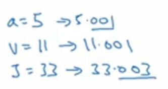
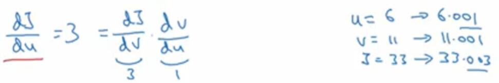

# 2.8 计算图的导数

> 视频：<https://mooc.study.163.com/learn/deeplearning_ai-2001281002?tid=2001392029#/learn/content?type=detail&id=2001701012>

这是上一节的流程图，假如我们要求`dJ/dv`，我们要怎么做呢？`v`现在等于`11`，`J=3v`就是`33`。如果我们让`v`增大一些，变成`11.001`，那么`J`就会变成`33.003`。所以`J`的增量是`v`的增量的三倍，导数为`3`。

这个类似于上一节的例子，其中`f(a)=3a`，`df/da=3`，只不过这里的`J`就相当于`f(a)`。

现在我们完成了第一步反向传播。那么`dJ/da`是多少呢？现在`a=5`，我们使其增加到`5.001`。那么`v`原先是`11`，现在变成了`11.001`。然后根据上面的过程，`J`变成了`33.003`。所以`J`的增量是`a`的增量的三倍，导数为`3`。

有另一种解释这个过程的方式，就是如果你改变了`a`，就会改变`v`，并且如果你改变了`v`就会改变`J`。`a`的改变从左向右传播。然后，`dJ/da`等于`dJ/dv`乘上`dv/da`，这在微积分里面叫做“链式法则”。我们可以验算一下。这里`dJ/dv=3`，`dv/da=1`，所以`dJ/da=3`。

现在我想介绍另一个符号约定，就是最终的输出变量，也就是计算图中最后一个符号叫做`J`。当然，你也可以给最终变量起一个很长的名字，比如`FinalOutputVar`，但是我们把它叫做`J`，有时候还可能是`L`。因为我们一直在计算最终输出变量的导数，所以在代码中，你可以省去`dJ`，将`dJ/dvar`命名为`dvar`。

接下来是这个计算图中的剩余部分。我们已知了`dJ/dv=3`，下面要求一下`dJ/du`。`u`现在是`6`，我们使其增加到`6.001`，`v`就增加到了`11.001`，所以`dv/du=1`。然后我们又知道`dJ/du = dJ/dv * dv/du`，所以`dJ/du=3`。

然后我们来看最后一个例子，`dJ/db`是什么呢？`b`现在是`3`，增加到`3.001`，`u=bc=2b`，所以应该增加到`6.002`，所以`du/db=2`。按照同样的方式，我们可以计算出，`dJ/db=6`。

当计算这些导数时，最有效率的方式就是从右向左计算。我们一步计算的`dJ/dv`会用于计算第二步的`dJ/du`，然后它又可用于计算`dJ/db`，以及其它。

所以一个计算图，就是一个正向传播，用于计算成本函数`J`，还有一个反向传播，用于计算`J`的导数。
