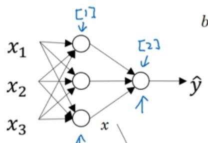

# 3.1 神经网络概览

首先回顾一下 logistic 模型，我们需要输入特征`x`，参数`w`和`b`。然后用它们计算`z`和`a`，`a`同时也是`y_hat`。然后可以计算损失函数`l`：

神经网络是这个样子的，你可以将许多 logistic 单元堆叠起来。

之前，我们只需要计算一次`z`和`a`，但在这个神经网络中，每个圆圈节点都对应`z`和`a`的一次计算。

我们使用`[i]`这样的记号来表示第`i`层节点相关的量。比如`[1]`表示第一层节点相关的量，`[2]`表示第二层节点相关的量。这是为了区分表示单个训练样本的圆括号。

所以，我们需要输入特征`x`，参数`w^[1]`和`b^[1]`，就能计算出`z^[1]`和`a^[1]`，这是第一层网络干的事情。

然后我们把`a^[1]`当成新的输入特性，计算出`z^[2]`和`a^[2]`。`a^[2]`就是神经网络的最终输出，可以用`y_hat`表示。

其中有很多细节，但关键是学到这种直觉。在 logistic 回归中，我们计算`z`和`a`；而在神经网络中，我们反复计算它们。在 logistic 回归中，会有一些反向计算，比如`da`和`dz`，神经网络中也是如此。
