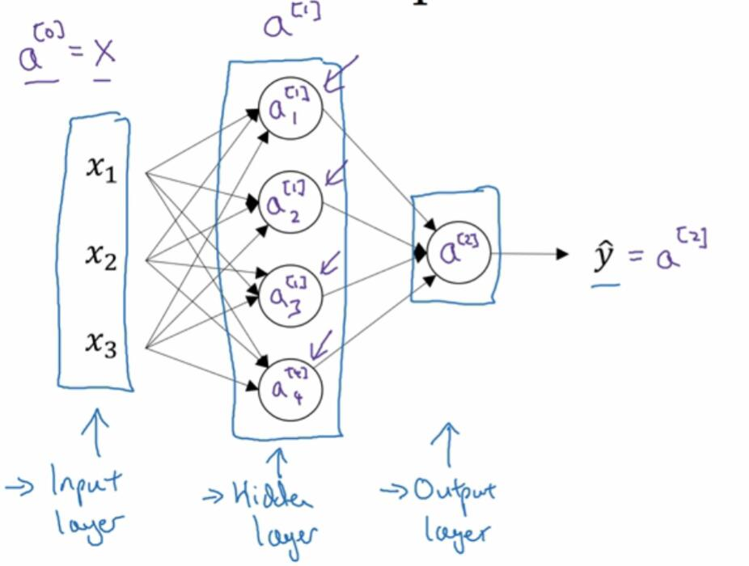
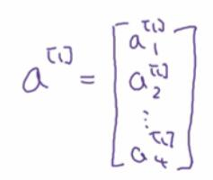

# 3.2 神经网络的表示

> 视频：<https://mooc.study.163.com/learn/deeplearning_ai-2001281002?tid=2001392029#/learn/content?type=detail&id=2001701018>

现在我们来讨论，我们画出的神经网络有什么意义。

首先我们来看看只有一个隐藏层的神经网络。

这就是上一节的神经网络，我们来命名一下各个部分。

我们的`x1, x2, x3`纵向堆叠，它们是神经网络的输入层。它们没什么特别的，只是我们的神经网络的输入。

中间那四个圆圈，我们称之为隐藏层。它们的意思是，在训练集中，我们不知道这些节点中的值。我们能看到输入和输出，隐藏层的值就是“隐藏”的。

最后的那个圆圈，是输出层，它负责输出预测值`y_hat`。

然后我们再引入几个符号。之前我们使用向量`x`表示输入特征，但还有一种表示方式，就是`a^[0]`。这个`a`表示“激活”，它代表这个值会传给下一层。

我们将第一层的激活值表示为`a^[1]`。具体来说，里面第一个单元或者节点，表示为`a^[1]_1`，以此类推。

这里的`a^[1]`是个四维向量，是因为这个例子中，我们有四个隐藏层的单元。

最后的`a^[2]`就是一个实数。

有趣的是，在约定俗成的术语中，这个东西叫做“双层神经网络”。当我们计算网络的层数时，不计算输入层，所以隐藏层就是第一层，输出层是第二层。

我们可以将输入层看做第零层，所以我们可以在字面上说，这是一个“三层”的神经网络。但你在研究论文时，你会发现人们把它称为双层神经网络。

隐藏层以及输出层是代参数的。这里的隐藏层带有两个参数，`w^[1]`和`b^[1]`。`w^[1]`是`4x3`的矩阵，`4`代表一共四个隐藏节点，`3`代表一共三个输入特征。`b^[1]`是`4x1`的向量。

输出层也有两个参数，`w^[2]`和`b^[2]`。`w^[2]`是`1x4`的，`b^[2]`是`1x1`的，因为隐藏层有四个节点，输出层有一个。

后面的章节中，会对这些矩阵的维度进行详细的解释。
