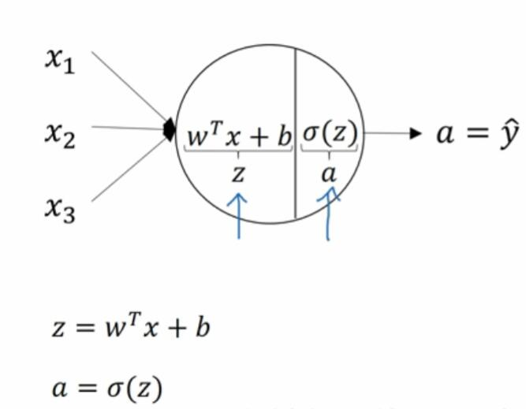
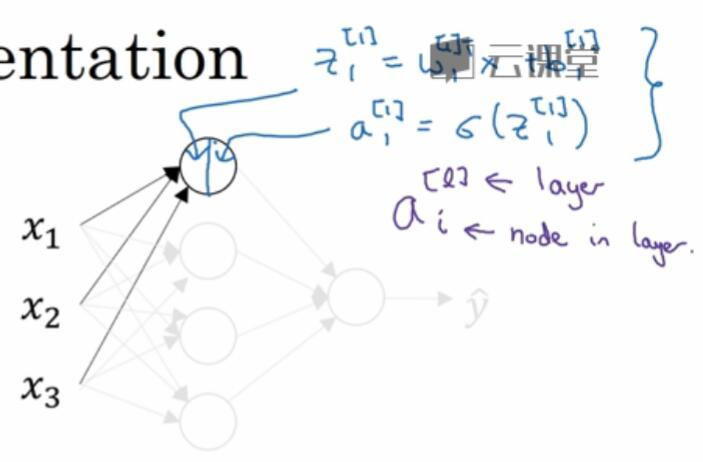
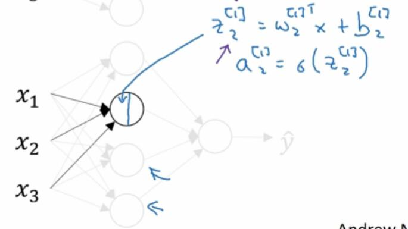
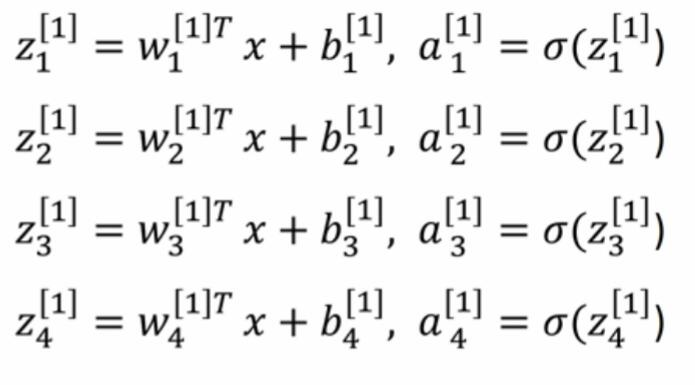
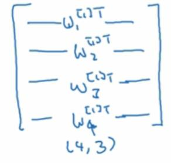
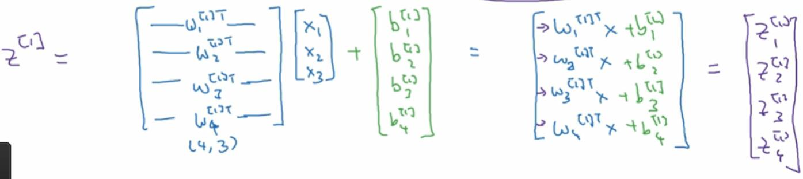
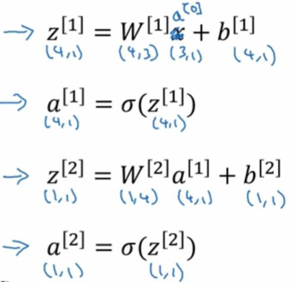

# 3.3 神经网络的计算输出

> 视频：<https://mooc.study.163.com/learn/deeplearning_ai-2001281002?tid=2001392029#/learn/content?type=detail&id=2001701019>

这一节，让我们深入了解神经网络在计算什么。

在 logistic 回归中，这里的圆圈代表了回归计算的两个步骤，首先计算`z`，然后计算`a`。

神经网络只不过时重复计算这几步很多次。

我们来看神经网络中的一个节点，比如隐藏层的第一个。这个节点进行如上的两步计算，我们在这里使用上标`[1]`表示第一层，使用下标`1`表示第一个节点。于是，我们有了：

然后第二步就是：

第二个节点也是如此，不赘述了。

然后我们，像这样，列出全部四个等式：

为了使其向量化，我们把`w^[1]_i`纵向堆叠，形成`w`。每个`w^[1]_i`是`1x3`的，`w`是`4x3`的。

`b^[1]_i`也是纵向堆叠。我们就会得到纵向堆叠的`z^[1]_i`，将其命名为`z^[1]`：

`a`也是一样，我们对`z^[1]`的每个元素应用 sigmoid，就得到了`a^[1]`。

这里面，`x`是`3x1`的，三个特征一个样本。`w^[1]`是`4x3`的，这一层有四个节点，上一层有三个节点（特征）。如果你把输入层看作第零层，`x=a^[0]`，就好理解了。`b^[1]`是`4x1`的。`z^[1]`和`a^[1]`都是`4x1`的。

对于第二层，`w^[2]`是`1x4`，因为这一层只有一个节点，上一层有四个节点。`b^[2]`是`1x1`的，只是一个实数。`z^[2]`和`a^[2]`也是个实数。

然后要记住，`w^[l]`是纵向堆叠的，不由`w^[l]_i`构成，而是`w^[l]T_i`。其它的没什么新东西，只不过我们不写`w`和`b`，而是写`w^[l]`和`b^[l]`。

